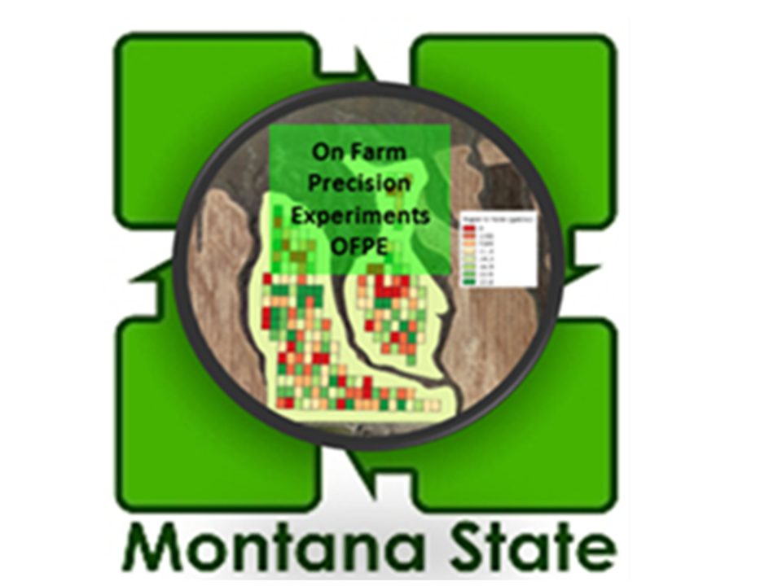
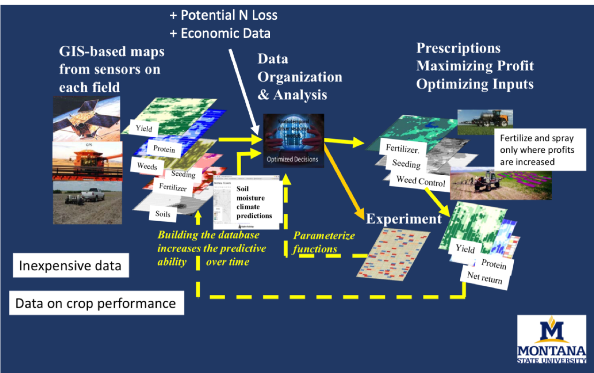
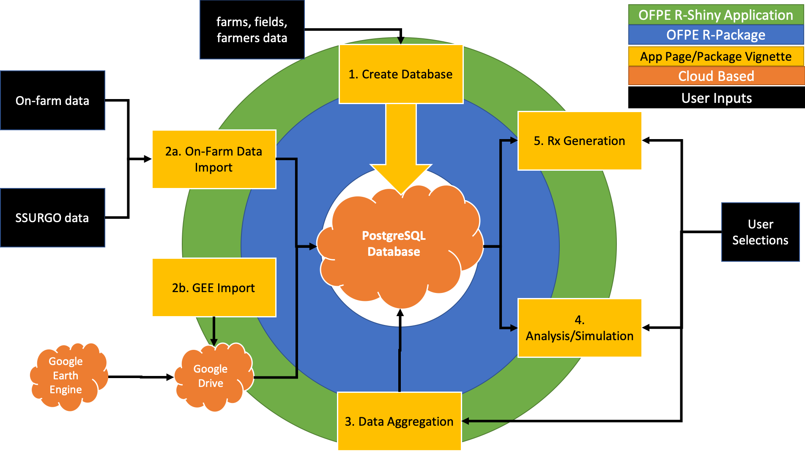

 
<!-- README.md is generated from README.Rmd. Please edit that file -->

```{r, include = FALSE}
knitr::opts_chunk$set(
  collapse = TRUE,
  comment = "#>",
  fig.path = "man/figures/README-",
  out.width = "100%"
)
```

# OFPE    
<!-- badges: start -->
[](https://www.repostatus.org/#active)
[)`-yellowgreen.svg)](/commits/master)
[](https://github.com/paulhegedus/OFPE/actions)
[](https://travis-ci.com/paulhegedus/OFPE)


## Installation

You can install the released version of OFPE from [GitHub](https://github.com) with:

``` r
# install.packages("devtools")
devtools::install_github("paulhegedus/OFPE", build_vignettes = TRUE)
```

And you can install the released version of the OFPE data package from [GitHub](https://github.com) with:

``` r
# install.packages("devtools")
devtools::install_github("paulhegedus/OFPEDATA")
```

## Overview
The [On-Field Precision Experiments project](https://sites.google.com/site/ofpeframework/) (OFPE) package is developed by the Agroecology Lab at Montana State University and provides the tools for researchers and producers to execute data intensive field management. Users are able to manage and analyze data collected from individual fields to make field specific recommendations of agricultural inputs. This project requires the experimental application of input rates to develop crop response functions for predicting outcomes of various management scenarios. 

This package contains tools for the OFPE data workflow. The OFPE data framework consists of the management of a database to store field specific information, and a data cycle that is repeated on an annual scale. The cycle begins by importing data collected on-farms or from remotely-sensed sources to the database, then aggregating all covariate data to the yield and protein datasets, analysis and simulation of ecological and economic outcomes, and generation of input prescriptions based on the field specific predictions. In the next year, data is collected and the cycle repeats, beginning with downloading that year's GEE data and importing data collected from on-farm equipment. 

Below (Fig. 1) is a schematic of the general On-Field Precision Experiments data workflow, with a more detailed description of the data handling process  [here](https://paulhegedus.github.io/OFPE-Website/ofpe_overview.html).

```{r, out.width='100%', fig.align='center', fig.cap='**Figure 1.** OFPE data framework showing the circular process of experiment creation and application, data collection, and prescription and experiment generation. Figured made by Bruce Maxwell (2015).', echo = FALSE}

```


More information/products of the MSU OFPE Project can be found at;

  * [OFPE Project Website](https://sites.google.com/site/ofpeframework/)
  * [OFPE Technical Website](https://paulhegedus.github.io/OFPE-Website/)
  * [OFPE Web Application](https://paulhegedus.shinyapps.io/OFPE_AnalysisAndSim_App_v1/?_ga=2.189182059.1336631904.1592115204-590292424.1592115204)
  * The OFPE Tools package vignettes & OFPE Data Package ([OFPEDATA]([here](https://github.com/paulhegedus/OFPEDATA.git)))
  * [OFPE CropScan Application](https://paulhegedus.shinyapps.io/OFPE_Protein_Application/?_ga=2.69643152.1880072526.1592481594-590292424.1592115204)

It is **strongly** recommended that the user familiarizes themselves with the OFPE project and the data workflow that this package supports by reading the general project information on the [OFPE Project Website](https://sites.google.com/site/ofpeframework/) and the descriptions and diagrams of the OFPE data cycle on the [OFPE Technical Website](https://paulhegedus.github.io/OFPE-Website/). The [OFPE Web Application](https://paulhegedus.shinyapps.io/OFPE_AnalysisAndSim_App_v1/?_ga=2.189182059.1336631904.1592115204-590292424.1592115204) may also be illuminating to see the intended use of this package's functions in a user friendly GUI. Finally, **please** read the *Workflow/Vignettes* section below and work through Vignettes 1 - 5 for a complete understanding of the usage of this package in supporting your own or your client's on-farm precision experiments. And of course, each class' and function's documentation is the best source for the process.

## Intended Use/Disclaimer
This package is intended to be used with dryland winter wheat harvest and application data collected in Montana, USA. The OFPE packages is intended to provide the codebase and documentation for the management, analysis, and development of agricultural input management prescriptions used by crop managers or researchers. The codebase constitutes the backend of the associate [OFPE Shiny web application](https://paulhegedus.shinyapps.io/OFPE_AnalysisAndSim_App_v1/?_ga=2.189182059.1336631904.1592115204-590292424.1592115204). This package was developed using conventional and organic winter wheat data and intended to inform site-specific management decisions of nitrogen fertilizer or seed rates. 

The OFPE package is not intended for use outside of Montana or for crops other than dryland winter wheat. We are not liable for any damages, actions, or outcomes of any decision made while using this this package or influenced by any associated intellectual property.

## Style Guide
The package follows [Google's R Style Guide](https://google.github.io/styleguide/Rguide.html) which follows the [Tidyverse Style Guide](https://style.tidyverse.org). However, there are a couple distinctions from Google's style guide. Rather than naming functions with 'BigCamelCase', they are named with 'smallCamelCase' in this package, while R6 classes are named with BigCamelCase and assigned to 'smallCamelCase' objects. Anything besides a class object or function is in 'snake_case.'

## Requirements
The workflows outlined and supported by functions in this package operate with the assumption that the user has access to or has created a PostgreSQL database. Associated tools such as PostGIS are required for data management. If a user is setting up a database on a local machine, the user will need to download [PostgreSQL](https://www.postgresql.org) and enable a *postgres* server account. This process is describe in this [tutorial](https://paulhegedus.github.io/OFPE-Website/postgres_setup.html). This is not needed if you have credentials to a preexisting OFPE formatted database. Note that depending on the size of your fields and farms and how many farmers you are managing, databases can be quite large (>100GB) and require dedicated storage space.

This package includes functions for interfacing with Google Earth Engine and Google Drive. To access and operate these functions, or for complete usage of the OFPE workflow, the user will need to set up a [Google Earth Engine](https://earthengine.google.com) account and sign up for [Google Drive](https://www.google.com/drive/). Additionally, the user will need a [Google API key](https://developers.google.com/maps/documentation/javascript/get-api-key) to plot maps with a Google satellite basemap.

While not required, it is assumed that the user has access and uses grain protein percent as a response variable complementary to winter wheat crop yield. This package assumes that the user is gathering protein data with [NextInstruments](https://www.nextinstruments.net) [CropScan 3300H](http://www.nextinstruments.net/index.php/products/cropscan) infrared on-combine monitor. Users can visualize their observed protein data from the CropScan monitor with the [OFPE Protein Vis App](https://paulhegedus.shinyapps.io/OFPE_Protein_Application/?_ga=2.163574524.1336631904.1592115204-590292424.1592115204).

Other on-farm data such as yield and as-applied fertilizer or seed rates do not require a specific brand association. This code has been tested with John Deere and Case equipment. 

## Workflow/Vignettes
The vignettes of the OFPE package and pages of the OFPE web application both follow the OFPE framework workflow. The vignettes are the low level API equivalent to pages found in the high level API found in the OFPE web application. Both of these tools are centered around and dependent on an OFPE formatted database (Fig. 2 & 3). The OFPE R package provides the codebase that interacts with the database in response to user actions. The OFPE web application uses the OFPE R package to provide an easy to use GUI interface to the users. This is represented in Figure 2 by the concentric rings surrounding the database, with the blue OFPE package ring closest to the database and the green OFPE web app ring closest to the users. The rings touch because the OFPE package powers the OFPE web app. The yellow boxes in Figure 2 represent each process in the OFPE data workflow, and are different pages available for the user on the OFPE web app, which also have an accompanying vignette in the OFPE R package to demonstrate the usage of the code outside of the OFPE web app GUI. This process consists of setting up (creating) the database with user specified field and farm data (Step 1), importing data collected on-fields and from open sources like SSURGO and Google Earth Engine (Step 2a & 2b), enriching yield and protein datasets by aggregating covariate data (Step 3), analyzing response of yield and protein to variable input rates, simulating and predicting net-return outcomes of management strategies (Step 4), and generating site-specific prescriptions of inputs (Step 5).

```{r, out.width='100%', fig.align='center', fig.cap='**Figure 2.** Key is found in the top right corner of the schematic. The green ring represents the R-Shiny OFPE web spplication which is driven by the OFPE R-Package (blue ring). These both require connection to a PostgreSQL spatial database with PostGIS enabled. The yellow boxes represent different pages of the OFPE web application and vignettes in the R-package. Black boxes represent user inputs and orange clouds represent cloud based tools.', echo = FALSE}

```


For more detailed information about the OFPE data workflow and framework, see this [website](https://paulhegedus.github.io/OFPE-Website/). This includes the tutorials linked above, as well as activity and component diagrams of the processes/vignettes described below.

Example data used in the vignettes can be found [here](https://github.com/paulhegedus/OFPEDATA.git) and installed using the code above. The vignettes show a workflow using data from "FarmerB" in the OFPEDATA package. Following along in the vignettes using only "FarmerB" data and importing GEE data for "FarmerB" from 2015 - 2020 should take ~5GB on your machine. This is to save memory and time when creating example databases. Users are encouraged to explore with "FarmerC" and "FarmerI" data, but remember that adding more farmer data or more data from GEE will require more space on your machine or server.  

### Database Creation/Management
This process begins with the creation of a spatial database for storing data gathered from farms and from satellite sources. This database is set up in  a specific OFPE format to support the ensuing workflow and requires the user to specify the boundaries of fields selected for data intensive management and the farm boundary within which a farmer's fields fall. This is a one-time process where once the database is set up it will only need management to keep it up to date.

The user will need access to an OFPE formatted database or need to create their own. In order to do this, see this [tutorial](https://paulhegedus.github.io/OFPE-Website/postgres_setup.html) for downloading PostgreSQL and creating an empty database. If using a pre-existing database, the user will need the host, username, password, and database driver. The database schematic and format can be found [here](https://paulhegedus.github.io/OFPE-Website/db_management.html)

The user will need access to or need to create necessary farm and field boundaries associated with their experimental fields to set up their database. These farm boundaries that encompass the fields within a farmer's ownership/management purview are imported as [assets into Google Earth Engine](https://paulhegedus.github.io/OFPE-Website/gee_setup.html) and imported into the database. See this [tutorial](https://paulhegedus.github.io/OFPE-Website/create_shp_qgis.html) for creating a shapefile of a field or farm boundary. These are necessary for identifying data based on geographic location rather than searching files for information keying in on field or farm specific information. Farm boundaries are also used as the bounding boxes for downloading Google Earth Engine data.

The process for creating a database and a more detailed description is outlined in the activity diagram on [this page](https://paulhegedus.github.io/OFPE-Website/db_management.html), where a component diagram can also be found.

### Data Import
The stream of data available from agricultural fields include data collected from farm machinery during normal farm operations such as seeding, spraying, and harvesting. The OFPE project focuses on winter wheat yield and protein as response variables and nitrogen fertilizer or seed rates as explanatory variables, depending on whether the field is farmed conventionally or organically, respectively. These data are collected from the farm machinery as ESRI Shapefiles, barring CropScan protein data that is gathered as a comma-separated values file. These data can be batch uploaded to the database through a script that automatically identifies and organizes each upload.

The process for importing on-farm data to the database is outlined and a more detailed description the activity diagram on [this page](https://paulhegedus.github.io/OFPE-Website/dat_import.html), where a component diagram can also be found.

Remote sensing data is collected from Google Earth Engine and includes data temporally variable data such as weather and static data such as topography. The user is responsible for running the Google Earth Engine Javascript code to download data for each year required. See this [tutorial](https://paulhegedus.github.io/OFPE-Website/gee_setup.html) for adding farm boundaries to GEE as asset and this [tutorial](https://paulhegedus.github.io/OFPE-Website/run_gee.html) for editing and using Javascript code. This data is downloaded to Google Drive, where the data can be batch uploaded to the database. See this [tutorial](https://paulhegedus.github.io/OFPE-Website/gd_setup.html) for setting up Google Drive to receive your data from Google Earth Engine.

The process for importing Google Earth Engine data to the database and a more detailed description is outlined in the activity diagram on [this page](https://paulhegedus.github.io/OFPE-Website/dat_import.html), where a component diagram can also be found.

### Data Aggregation
Raw data from various sources need to be wrangled and aggregated together before statistical analysis and model development. Because yield and protein data are related to crop production and quality, the source of winter wheat value, covariate and explanatory data are used to enrich yield and protein datasets Due to equipment differences, yield and protein are gathered at different temporal resolutions (3 and 10 seconds, respectively) and subsequent spatial resolution, so are treated as separate datasets and not combined based on interpolation or estimation of protein data. The OFPE project aims to use the finest resolution of data possible to make decisions with data that has as little natural variation removed as possible.

The activity workflow for enriching yield and protein datasets and a more detailed description is described on [this page](https://paulhegedus.github.io/OFPE-Website/data_agg.html), where a component diagram can also be found.

### Analysis/Simulation
Once all explanatory and covariate data is aggregated to the response data observations, it can be used to train models of crop production (yield) or quality (protein). Experimentally varying input rates (fertilizer or seed) is crucial to developing the function for the relationship between the crop response and input. These models are then used in a Monte Carlo simulation that randomly selects an economic condition (winter wheat price, price of fertilizer or seed) to generate the probability of outcomes. Because the farmer has to make a decision on their input rates by March 30th for winter wheat, the farmer will not know the weather conditions for the rest of the growing season, so the user will be able to select a year or scenario to simulate. The user also has control over the model functional type used and how to optimize the input. The simulation is a Monte-Carlo simulation that iteratively selects a year from a period of record from which to predict crop responses and net-returns under that year's observed price and or weather conditions. The user can provide a data frame with ranges of prices received and the cost of the experimental variable. After the simulation, the probability of the site-specific optimization management strategy can be compared to other strategies such as the minimum rate of input (typically zero for nitrogen fertilizer, non-zero for seeding rates), the farmer selected uniform rate, the full-field optimized rate, if the actual experiment applied in the simulated year, and if the crop was grown in the opposite system type. For example, if the farmer grows conventional wheat, this would be the management case where zero fertilizer is applied and an organic price is received. If the farmer is an organic grower, than this management scenario is simply the farmer selected rate with conventional prices received. The user can use this tool to simulate different management outcomes under various economic and climate scenarios to decide conditions for which to make an input prescription for the upcoming year.

The activity workflow for simulating management outcomes is described on [this page](https://paulhegedus.github.io/OFPE-Website/sim_anal.html), where a component diagram can also be found.

### Prescription Generation
After the user analyzes the field specific data from their specified year and decides on a management strategy, a prescriptive fertilizer or seed map can be generated based on optimizing inputs. This optimization can take the form of profit maximization or profit maximization and pollution minimization. This prescription can reflect a specified price scenario or the mean of inputs across simulation results. The prescription is exported as a shapefile that the farmer can upload to their equipment and apply the inputs. The user has the option of including experimental rates, with the prescriptive rates as a base, or to make a pure prescription, in which case check rates can be added to the map to assess the how the prescription performs compared to a farmer selected rate. Alternatively, the user can elect to create a new experiment for a field. They must select a field present in the 'all_farms.fields' table of the OFPE database to create the experiment for. The user has the option of stratifying the experiment on previous data available in the database, such as yield, protein, or previous as-applied rates. The user must provide the number of experimental rates to apply if experimental rates are applied, as well as the number of optimum rates to use. In addition to the base rate applied, the sum should equal the equipment limitation on rates applied.

The activity workflow for generating prescriptions and a more detailed description is described on [this page](https://paulhegedus.github.io/OFPE-Website/rx_gen.html), where a component diagram can also be found.

### Funding
The OFPE project was initially funded by the Montana Research and Economic Development Initiative ([MREDI](https://mus.edu/research/research_initiative.html)) and is continued to be funded by the Montana Fertilizer Advisory Committee ([MFAC](https://agriculture.montana.edu/mfac/index.html)). Other funding sources include the Montana State University College of Agriculture ([MSU CoA](https://agriculture.montana.edu)), the MSU Department Land Resources and Environmental Sciences ([LRES](https://landresources.montana.edu)), and the Montana Institute on Ecosystems ([MT IoE](https://montanaioe.org)). Other support and funding has been provided by the Data Intensive Farm Management project at the University of Illinois ([DIFM](https://publish.illinois.edu/data-intensive-farm-managment/)). Funding for Paul Hegedus is provided by MSU and the Graduate Student Grants from the Western Sustainable Agriculture Research and Education (WSARE).

#        
