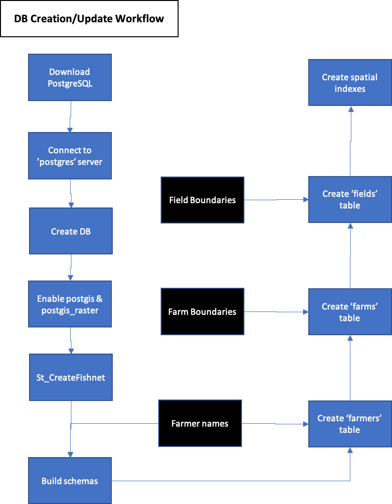

# Introduction
This is the first tutorial in the OFPE data workflow and typically the initial step before the OFPE data cycle. The Manage Database section below can be used to add new farmers, farms, or fields to the database. More information on creating the database can be found on this [page](https://paulhegedus.github.io/OFPE-Website/db_creation.html) at the [OFPE Technical Website](https://paulhegedus.github.io/OFPE-Website/index.html).

The user will need access to a server or need to create their own. In order to do this, see this [tutorial](https://paulhegedus.github.io/OFPE-Website/postgres_setup.html) for downloading PostgreSQL and creating a local database. If using a pre-existing database, the user will need the host, username, password, and database driver. 

This process begins by building a spatial database for storing data gathered from farms and from satellite sources. This database is set up in  a specific OFPE format to support the ensuing workflow and requires the user to specify the boundaries of fields selected for data intensive management and the farm boundary within which a farmer's fields fall. Setting up the database is a one-time process where once the database is set up it will only need management to keep it up to date.

The user will need access to or need to create necessary farm and field boundaries associated with their experimental fields to set up their database. These farm boundaries that encompass the fields within a farmer's ownership/management purview are imported as assets into Google Earth Engine and imported into the database. See this [tutorial](https://paulhegedus.github.io/OFPE-Website/create_shp_qgis.html) for creating a shapefile of a field or farm boundary. These are necessary for identifying data based on geographic location rather than searching files for information keying in on field or farm specific information. Farm boundaries are also used as the bounding boxes for downloading Google Earth Engine data.

The process this vignette demonstrates is represented in the activity diagram shown in Figure 1, which can also found on this [page](https://paulhegedus.github.io/OFPE-Website/db_creation.html), where a component diagram can also be found.

```{r, out.width='100%', fig.align='center', fig.cap='**Figure 1.** Blue processes are chained together by arrows indicating the next step in the workflow, and black boxes indicate the addition of user inputs.', echo = FALSE}

```


# Resources
The resources below are strongly recommended as supplemental information regarding the use and intent of this vignette and associated functions.

  * [OFPE Project Website](https://sites.google.com/site/ofpeframework/): Project information and products from the MSU OFPE project.
  * [OFPE Technical Website](https://paulhegedus.github.io/OFPE-Website/index.html): Website with more detailed descriptions of the OFPE data cycle and workflow, as well as tutorials for external data processes that cannot be performed in R.
  * [OFPE Overview](https://paulhegedus.github.io/OFPE-Website/ofpe_overview.html): Page of the OFPE Technical Website describing an overview of the OFPE data cycle and workflow.
  * [OFPE Database Management](https://paulhegedus.github.io/OFPE-Website/db_management.html): Detailed description of the OFPE database set up
  * [PostgreSQL Database Set-Up](https://paulhegedus.github.io/OFPE-Website/postgres_setup.html): Tutorial for downloading PostgreSQL and PostGIS and creating a spatial database. 
  * [Create ESRI Shapefiles](https://paulhegedus.github.io/OFPE-Website/create_shp_qgis.html): Tutorial for creating ESRI shapefiles for farm and field boundaries required for the OFPE data cycle.

The [PostgreSQL Database Set-Up](https://paulhegedus.github.io/OFPE-Website/postgres_setup.html) tutorial is required before using this vignette. It is recommended that the database created is named 'OFPE' for continuity with the rest of these vignettes.

# Workflow
The sections below describe the process of building and setting up an intitial OFPE database for the first time and loading data into the database. The initial seciton loads the required packages and connects to the database. If the user does not have farm and field boundaries to upload, use the section for setting up example data in order to follow along with this and all of the vignettes.

## Set-Up
The below contains the packages used in the vignette and a demonstration of connecting to your database created in this [tutorial](https://paulhegedus.github.io/OFPE-Website/postgres_setup.html). This vignette uses example data located in the [OFPEDATA](https://github.com/paulhegedus/OFPEDATA.git) R-package. This vignette downloads data from the OFPE package in order to demonstrate a realistic data workflow. 

### Load Packages

```{r setup, message = FALSE, eval = FALSE}
#devtools::install_github("paulhegedus/OFPE")
#devtools::install_github("paulhegedus/OFPEDATA")
library(OFPE)
library(OFPEDATA)
#library(sf)
#library(RPostgreSQL)
```

### Connect to Database

First, a connection is formed to the database created in this [tutorial](https://paulhegedus.github.io/OFPE-Website/postgres_setup.html). This vignette, and the rest of the vignettes are working with an example database named 'OFPE' (as named in the tutorial). This package utilizes an R6 class for containing the database connection information and the connection itself. This class is PostgreSQL sp

```{r, eval = FALSE}
db <- DBCon$new(
  user = "postgres",
  password = "<your_password>",
  dbname = "<your_db_name>", 
  host = "localhost",
  port = "5432"
)
```

```{r, echo = FALSE, eval = FALSE}
db <- DBCon$new(
  user = "postgres",
  password = "Paul210220",
  dbname = "OFPE", 
  host = "localhost",
  port = "5432"
)
```

### Prepare Example Data
This section is for creating a folder that contains the experimental field and farm boundaries. See this [tutorial](https://paulhegedus.github.io/OFPE-Website/create_shp_qgis.html) for creating a shapefile of a field or farm boundary. **NOTE:** when using your own data, this section is irrelevant, but you still might want to check out that tutorial.

First, get the names of the data in the OFPEDATA package that has example data for these vignettes. Isolate the names of data corresponding to field or farm boundaries, labeled with 'bbox'. Extract from OFPEDATA.

```{r, eval = FALSE}
dat <- data(package = "OFPEDATA")
dat_names <- dat$results[, "Item"] %>%
  subset(grepl("_bbox", dat$results[, "Item"]))
dat_list <- as.list(dat_names) %>%
  `names<-`(dat_names) %>% 
  lapply(function (x) eval(parse(text = x)))
rm(dat, dat_names) 
```

Second, save boundaries to a temporary folder. Again, in your real world situation you do not need to do this. **NOTE:** This example will create a temporary folder called 'INIT_UPLOADS' in your home directory and WILL delete any folder called 'INIT_UPLOADS' in your home directory.

```{r, eval = FALSE}
temp_path <- "~/INIT_UPLOADS/"
ifelse(dir.exists(temp_path), 
       {do.call(file.remove, list(list.files(temp_path, full.names = TRUE)));
         file.remove(temp_path);
         dir.create(temp_path)},
       dir.create(temp_path)) %>% 
  invisible()
mapply(function (x, y) sf::st_write(x, paste0(temp_path, y, ".shp")),
            dat_list, 
            names(dat_list)) %>% 
  invisible()
rm(dat_list, temp_path)
```

## Database Set-Up
This section is for building the database and loading required extensions such as PostGIS. At this point, the user is expected to have followed the PostgreSQL download and set up tutorial found in the [link](https://paulhegedus.github.io/OFPE-Website/postgres_setup.html) below. This is the first step of the OFPE data cycle and should only be required once. If adding more farmers, fields, or farms to the database, see the Manage Database section below. This section utilizes an R6 Class called BuildDB that is used to build and set-up an OFPE formatted database. This vignette operates under the assumption of a local server group established on the user's machine and that the user has created a database as in tutorial below. 

  * PostgreSQL Database Set-Up : [Tutorial](https://paulhegedus.github.io/OFPE-Website/postgres_setup.html)

### Initialize BuildDB
The BuildDB class is initialized with a database connection and a list of farmers for which to build schemas for. This list of farmers does not need to be exhaustive, as farmers can be added later. When adding farmers using the ManageDB class (see section below), the appropriate schemas will be built. This BuildDB class is only for use when setting up an OFPE database for the first time.

For demonstrative purposes, not all of the farmers available in the example data from the [OFPEDATA](https://github.com/paulhegedus/OFPEDATA.git) package are used to initialize the database. This is to show how to add a farmer later in the Manage Database section of this vignette.

```{r, eval = FALSE}
farmers <- c("FarmerB", "FarmerC")
buildDB <- BuildDB$new(db$db, "2.5", farmers)
```

### Build Database
All methods are public for documentation purposes, however the only function needed to set up the database is below. The other functions listed in the documentation are not recommended for single use as the BuildDB class is intended to be used once upon database inception and not running the  functions in order could cause an error. The trhee functions are described below, see their help pages wiht '?BuildDB' for more information.

#### Load Extensions: loadExtensions()
There are a couple extensions that need to be activated in the database. First is [PostGIS](https://postgis.net), an extension of PostgreSQL database, and the second is an extension of PostGIS enabling raster functionality. Finally, a function for creating a net across an area is made. These are the minimum extensions needed for the OFPE data cycle. The function does not require arguments if you provided all arguments to the initializer function. If you provide arguments, as in a single use case, they will be used rather than the attributes you initialized the object with.

### Build Schemas: buildSchemas()
Additionally, the BuildDB object will generate two schemas for each farmer, one to hold raw and one to hold aggregated data. A general schema called 'all_farms' is also built. 

### Build Tables: buildTables()
There are three tables that are initialized when building the OFPE database. These three initial tables are created in the 'all_farms' schema; 'farmers', 'farms', and 'fields' which are filled in using the manager functions below.

Again, the function below simply runs each of the functions above in the intended order. Running those functions out of order will likely result in errors.

```{r, eval = FALSE}
# not run
buildDB$buildDatabase()
```

## Manage Database
This section is for managing and updating general information related to  on-farm precision experiments. It is also used to add initial data to the database upon inception in the method above. This data includes the names of collaborating farmers, the names of and boundaries for areas that encompass the experimental fields, and the names of and boundaries for experimental fields. **Note** you do not need to upload the field boundaries for all of the field's for which you upload data, just the fields that have experimental rates applied. For example, if you want to import data from a field with no experiments, perhaps for future comparisons, you would not need to include a field boundary until you want to analyze that data. **However**, any field data that you upload needs to fall within a farm boundary, otherwise it cannot be sorted into the database upon upload.

The user will need access to or need to create necessary farm and field boundaries associated with their experimental fields to set up their database. These farm boundaries that encompass the fields within a farmer's ownership/management purview are both imported as assets into Google Earth Engine and imported into the database. See this [tutorial](https://paulhegedus.github.io/OFPE-Website/create_shp_qgis.html) for creating a shapefile of a field or farm boundary. These are necessary for identifying data based on geographic location rather than searching files for information keying in on field or farm specific information. Farm boundaries are also used as the bounding boxes for downloading Google Earth Engine data. The shapefile naming convention for fields is "<fieldname>_bbox.shp" while the shapefile naming convention for farm boundaries is "<farmername>_<farmname>_bbox.shp". This format is used because there are sometimes multiple farm boundaries corresponding to one farmer if their operations are spread across a large area (i.e. multiple counties). **NOTE:** Do not use the same name for a farm and a field. You must have the farm or field name present in the corresponding shapefile name. 

### ManageDB Class
This section utilizes an R6 Class called ManageDB that is used to update or add data to the OFPE database. This utilizes other R6 classes such as ManageFarmers, AddFields, and AddFarms, on request by the user. The modularity of the ManageDB class allows for users to create their own classes that can be integrated and passed into the ManageDB class. This vignette section operates under the assumption that the section above has been completed once for your database to enable extensions and add initial tables. This class takes a list of lists as an argument with an 'action class' name and associated parameters. 'Actions classes' include ManageFarmers(), ManageFarms(), and ManageFields(). 

### Initial Upload
This section provides an example of uploading an initial batch of experimental information to the database, including the farm and field names and boudnaries and the vector of farmer names. This information fills in the tables created with the BuildDB class. The section below will demonstrate how to add more farmers, fields, or farms to the database. 

For demonstrative purposes, not all of the farmers available in the example data from the [OFPEDATA](https://github.com/paulhegedus/OFPEDATA.git) were used to build the database above in order to illustrate how to update and add to the database. 

#### Initial Parameters
Initial parameters are provided below. When using your own data you will have different farm and field names. And perhaps a lot more than two. First, supply your inputs, this example uses the same 'farmers' as defined above. 

```{r, eval = FALSE}
farm_names <- c("FarmerB_FarmName", "FarmerC_FarmName")
farm_path <- "~/INIT_UPLOADS/"

field_names <- c("sec35mid", "millview")
field_path <- "~/INIT_UPLOADS/"
```

#### Initialize ManageDB
The ManageDB class is initialized with a database connection, and a list of R6 action class names and associated arguments to run. These include a list of farmers to add to or update the database with, farm names and a file path to farm boundaries, and field names and a file path to field boudnaries. When adding farmers using the ManageDB class the appropriate schemas will be built.

Any or all of these R6 classes can be ran at any time in any order, however the user needs to be logical. If you are updating a new field from a new farmer but haven't added the new farm yet, no association with a farm can be made with the field, because the farm doesn't exist. Start at coarse spatial scales (farmers, farms) and then upload finer scale data (fields).

```{r, eval = FALSE}
action_list <- list(
  list(
    action = "ManageFarmers",
    farmers = farmers
  ),
  list(
    action = "ManageFarms", 
    farm_names = farm_names,
    farm_path = farm_path
  ),
  list(
    action = "ManageFields",
    field_names = field_names,
    field_path = field_path
  )
)
```

Now, pass the arguments on to the ManageDB class generator along with a database connection. Each of the action R6 classes specified by the user have the same interface that includes setup() and upload() methods. These are called from the ManageDB class automatically when it's initializeActions() method is called.

```{r, eval = FALSE}
manageDB <- ManageDB$new(db$db, action_list)
manageDB$setupActions()
```

#### Execute ManageDB
After a ManageDB class object has been created and set up, the user can run the 'executeActions' method to add information to the database. The modularity of this class allows users to add R6 classes that they have built and pass them into the executeAction method. For example, a user may want to build a method or two for deleting information or adding information to other tables. See this [page](https://stackoverflow.com/questions/40295279/r-how-do-i-add-an-extra-function-to-a-package) for information on how to add to a package or clone the [OFPE package](https://github.com/paulhegedus/OFPE.git) Github repository, add your own classes and re-install the package from your source files.

After the user has initialized the class, running the executeAction method will run the functions associated with each action method.

```{r, eval = FALSE}
manageDB$executeActions()
```

Now there should be data filled in the 'farmers', 'farms', and 'fields' tables in the 'all_farms' schema of the database. The section below will demonstrate how to add another farmer and their associated farm and fields.

### Adding Data
#### Initial Parameters
#### Initialize ManageDB


### Spatial Indexes?

# Conclusion
This vignette provided a demonstration of how to set-up a freshly created database following the completion of this [tutorial](https://paulhegedus.github.io/OFPE-Website/postgres_setup.html). A BuildDB class object is generated once per database and 

Although the classes in this vignette interact with the database, none of them include any methods for deleting information. It is expected that the user will be able to execute a database query to remove any unwanted information.

Whenever a database connection is open it needs to be closed.
```{r, eval = FALSE}
dbDisconnect(db$db) %>% invisible()
```


