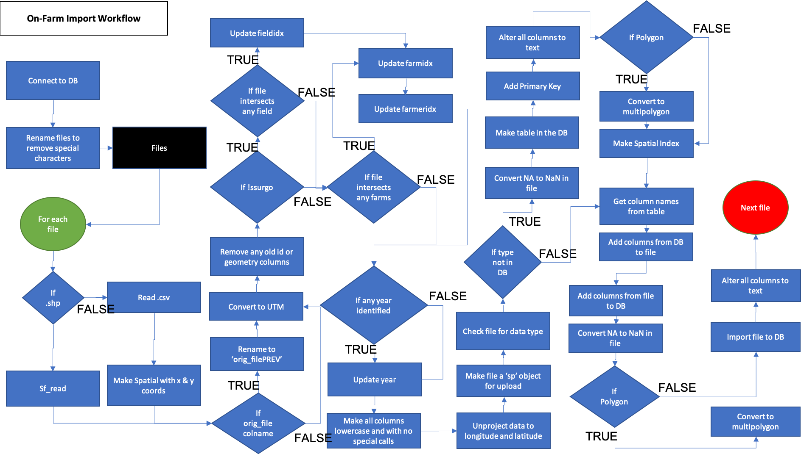
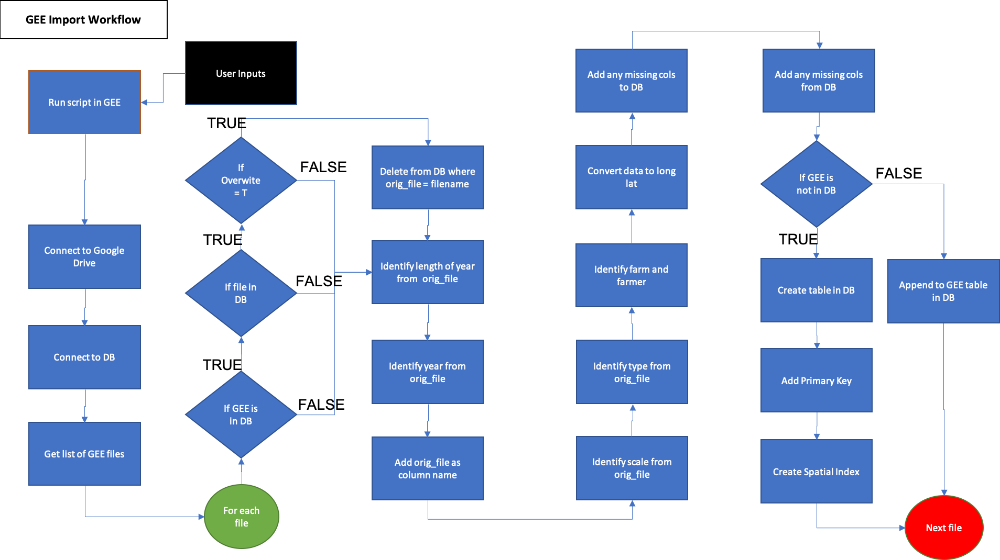
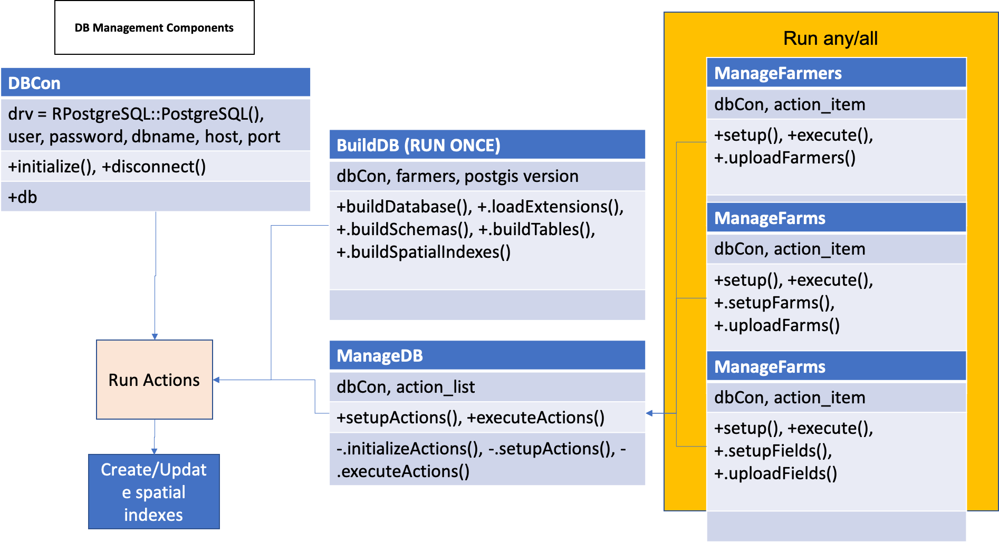

# Introduction
This tutorial covers the data import process. This step requires an OFPE formatted database as created on this  [page](https://paulhegedus.github.io/OFPE-Website/db_creation.html) or as done in Vignette 1 of this package. Please refer to the [OFPE Technical Website](https://paulhegedus.github.io/OFPE-Website/index.html) for more information. This tutorial covers the import of on-farm collected data to the database in section 1 and the import of data from Google Earth Engine in section 2.


#### On-Farm Data
The stream of data available from agricultural fields include data collected from farm machinery during normal farm operations such as seeding, spraying, and harvesting. The OFPE project focuses on winter wheat yield and protein as response variables and nitrogen fertilizer or seed rates as explanatory variables, depending on whether the field is farmed conventionally or organically, respectively. These data are collected from the farm machinery as ESRI Shapefiles, barring CropScan protein data that is gathered as a comma-separated values file. These data can be batch uploaded to the database through a script that automatically identifies and organizes each upload.

This vignette and this data import process simply imports each piece of data collected on farms. The import process consists of identifying where the data for upload should be organized within the database. If the data for upload matches the boundary of an experimental field uploaded into the 'all_farms' schema (see Vignette 1). If so, the field is identified, otherwise the data is spatially queried for an intersection with a farm in order to identify the farmer that owns the field. This is used to determine into which farmer's schema to organize the data. Finally, the data is explored for the identification of the year the data was collected. While not required for organizing and importing the data, without identifying the year, the data may not be available for analysis when the user selects the year for analysis.

After the schema that the data should be imported to is identified, the data is queried to determine what type of data it is. Within each schema, tables are divided by data type, with tables for yield, protein, and as-applied inputs. Additionally, the geometry type of each file is determined in order to separate data present as polygons or points. This is only the case for as-applied data that either is collected as polygons or points. 

Finally, the data either creates a new table or is appended to an existing table in the appropriate database schema. After each import session spatial indices on each table are generated, if not previously present, or updated. 

Note that the OFPE formatted database can also handle the upload of [SSURGO soil data](https://www.nrcs.usda.gov/wps/portal/nrcs/detail/soils/survey/?cid=nrcs142p2_053627) that can be used as a covariate. This data can be gathered from the SSURGO database. **NOTE:** when uploading this data, MAKE SURE to have "ssurgo" somewhere in the name of the file.

Also of note is that when import seeding rate data, this **NEEDS** to have either "seed" or "_SR_" in the filename. This is because the seeding rate and as-applied nitrogen rate data are not easily distinguishable from each other.

The process for importing on-farm data to the database is outlined and a more detailed descriptionin the activity diagram on [this page](https://paulhegedus.github.io/OFPE-Website/dat_import.html), where a component diagram can also be found.

```{r, out.width='100%', fig.align='center', fig.cap='**Figure 1.** On-Farm data import workflow. Blue processes are chained together by arrows indicating the next step in the workflow, and black boxes indicate the addition of user inputs.', echo = FALSE}

```

#### Google Earth Engine Data
Remote sensing data is collected from Google Earth Engine and includes data temporally variable data such as weather and static data such as topogrophy. The user is responsible for running the Google Earth Engine Javascript code to download data for each year required. See this [tutorial](https://paulhegedus.github.io/OFPE-Website/gee_setup.html) for adding farm boundaries to GEE as asset and this [tutorial](https://paulhegedus.github.io/OFPE-Website/run_gee.html) for editing and using Javascript code. This data is downloaded to Google Drive, where the data can be batch uploaded to the database. See this [tutorial](https://paulhegedus.github.io/OFPE-Website/gd_setup.html) for setting up Google Drive to receive your data from Google Earth Engine.

This [tutorial](https://paulhegedus.github.io/OFPE-Website/run_gee.html) outlines how to gather data from Google Earth Engine. This step needs to be completed before executing section 2 of this vignette.

The process for importing Google Earth Engine data to the database and a more detailed description is outlined in the activity diagram on [this page](https://paulhegedus.github.io/OFPE-Website/dat_import.html), where a component diagram can also be found.

```{r, out.width='100%', fig.align='center', fig.cap='**Figure 2.** Google Earth Engine data import workflow. Blue processes are chained together by arrows indicating the next step in the workflow, and black boxes indicate the addition of user inputs.', echo = FALSE}

```

# Resources
The resources below are strongly recommended as supplemental information regarding the use and intent of this vignette and associated functions.

  * [OFPE Project Website](https://sites.google.com/site/ofpeframework/): Project information and products from the MSU OFPE project.
  * [OFPE Technical Website](https://paulhegedus.github.io/OFPE-Website/index.html): Website with more detailed descriptions of the OFPE data cycle and workflow, as well as tutorials for external data processes that cannot be performed in R.
  * [OFPE Overview](https://paulhegedus.github.io/OFPE-Website/ofpe_overview.html): Page of the OFPE Technical Website describing an overview of the OFPE data cycle and workflow.
  * [OFPE Data Import](https://paulhegedus.github.io/OFPE-Website/dat_import.html): Detailed description of the OFPE on-farm data import process.

Again, it is assumed that the user has completed Vignette 1 and understands the database management methods described at this [site](https://paulhegedus.github.io/OFPE-Website/dat_import.html). A database is required to store your data.

# Workflow
The sections below describe the process of importing data collected on-farms to the OFPE formatted database. The initial section loads the required packages and connects to the database. 

## Set-Up
The below contains the packages used in the vignette and a demonstration of connecting to your database created in this [tutorial](https://paulhegedus.github.io/OFPE-Website/postgres_setup.html). This vignette uses example data located in the [OFPEDATA](https://github.com/paulhegedus/OFPEDATA.git) R-package. This vignette downloads data from the OFPE package in order to demonstrate a realistic data workflow. 

### Load Packages

```{r setup, message = FALSE, eval = FALSE}
#devtools::install_github("paulhegedus/OFPE")
#devtools::install_github("paulhegedus/OFPEDATA")
library(magrittr)
library(OFPE)
library(OFPEDATA)
```

### Connect to Database

First, a connection is formed to the database created in this [tutorial](https://paulhegedus.github.io/OFPE-Website/postgres_setup.html). This vignette, and the rest of the vignettes are working with an example database named 'OFPE' (as named in the tutorial above and exemplified in Vignette 1). This package utilizes an R6 class for containing the database connection information and the connection itself. This class defaults to a PostgreSQL database.

```{r, eval = FALSE}
dbCon <- DBCon$new(
  user = "postgres",
  password = "<your_password>",
  dbname = "<your_db_name>", 
  host = "localhost",
  port = "5432"
)
```

```{r, echo = FALSE, eval = FALSE}
dbCon <- DBCon$new(
  user = "postgres",
  password = "Paul210220",
  dbname = "OFPE", 
  host = "localhost",
  port = "5432"
)
OFPE::removeTempTables(dbCon$db) # removes temporary tables
```

### Prepare Example Data
This section is for creating a folder that contains the experimental field data. **NOTE:** when using your own data, this section is irrelevant, but you still might want to check out that tutorial.

First, get the names of the data in the OFPEDATA package that has example data for these vignettes. Isolate the names of data corresponding to field data which does not have "_bbox" suffix. Extract from OFPEDATA.

```{r, eval = FALSE}
dat <- data(package = "OFPEDATA")
dat_names <- dat$results[, "Item"] %>%
  subset(!grepl("_bbox", dat$results[, "Item"]))
dat_list <- as.list(dat_names) %>%
  `names<-`(dat_names) %>% 
  lapply(function (x) eval(parse(text = x)))
rm(dat, dat_names) 
```

Second, save boundaries to a temporary folder. Again, in your real world situation you do not need to do this. **NOTE:** This example will create a temporary folder called 'INIT_UPLOADS' in your home directory and WILL delete any folder called 'INIT_UPLOADS' in your home directory.

```{r, eval = FALSE}
temp_path <- "~/INIT_UPLOADS/"
ifelse(dir.exists(temp_path), 
       {do.call(file.remove, list(list.files(temp_path, full.names = TRUE)));
         file.remove(temp_path);
         dir.create(temp_path)},
       dir.create(temp_path)) %>% 
  invisible()
toTempFolder <- function (x, y) {
  if (!grepl("pro", y)) {
    sf::st_write(x, paste0(temp_path, y, ".shp"), quiet = TRUE)
  } else {
    data.table::fwrite(x, paste0(temp_path, y, ".csv"))
  }
}
mapply(toTempFolder,
       dat_list, 
       names(dat_list)) %>% 
  invisible()
rm(dat_list, temp_path)
```


## Import On-Farm Data
The steps required for importing the data consist of initializing the import data R6 class with the path to the folder in which the data to be uploaded is saved. It is efficient to put all the data you want to import into one folder and path to that. That way you can instantiate the class, run it, and walk away for awhile while it loads. The on-farm import class has a method for intializing and a method for running. After the completion of the execution method, a data frame with the status of each attempted file is generated.

### Initialize ImportOF
The ImportOF class is initialized with the path to the location of the data that the user wants to upload and a database object. This class can be initialized and executed as many times as needed. Data that is already present in the database and reuploaded to the database will be replaced.

All of the data available in the example data from the [OFPEDATA](https://github.com/paulhegedus/OFPEDATA.git) package are used as an example here. The steps for uploading data are always the same.  

```{r, eval = FALSE}
pathToDat <- "C:/Users/paulhegedus/Documents/INIT_UPLOADS"  #"~/INIT_UPLOADS/"
importOF <- ImportOF$new(dbCon, pathToDat)
```

### Import On-Farm Data
The execution method of the ImportOF class simply requires the file names to the data that is to be uploaded into the database. After the method has completed execution, the 'status' object in the ImportOF R6 class will indicate which files uploaded successfully and which did not.

```{r, eval = FALSE}
importOF$executeUpload()
```


### Check Status
After the 'uploadData' method of the 'ImportOF' class has been executed, the import status of your data can be found in the 'status' object, a dataframe indicating the completion/fail of each file name.

```{r, eval = FALSE}
importOF$status
```


## Import Google Earth Engine Data
The steps required for importing data from Google Earth Engine are outlined below. Google Earth Engine data is gathered as discussed in these tutorials, [Google Earth Engine Set-Up](https://paulhegedus.github.io/OFPE-Website/gee_setup.html) and  [Run Google Earth Engine](https://paulhegedus.github.io/OFPE-Website/run_gee.html). Data is downloaded from GEE to Google Drive, where it is accessed by the R6 class below.

This class utilizes the same database connection used for importing data on-farms.

Before using the ImportGEE class, the Google Drive account where the user data is stored needs to be authorized. Simply insert your email address in the line below.

```{r, eval = FALSE}
googledrive::drive_auth("<your_email@address>")
```

```{r}
googledrive::drive_auth("paulhegedus@montana.edu")
```


### Initialize ImportGEE
The ImportGEE class is initialized with the path to the location of the Google Drive folder where the data is connected, and a database connection. This class can be initialized and executed as many times as needed. Data that is already present in the database and re-uploaded to the database will be replaced if desired by setting the option of OVERWRITE to TRUE.

```{r, eval = FALSE}
pathToDat <- "GEE_Surfaces_4package"
importGEE <- ImportGEE$new(dbCon, pathToDat, FALSE)
```


### Import Google Earth Engine Data
The execution method of the ImportGEE class simply requires the name of the Google Drive folder with data to be uploaded into the database. As data is uploaded, messages will appear on the status of the import.

```{r, eval = FALSE}
importGEE$executeUpload()
```


# Conclusion
This vignette provided a demonstration of how to import your on-farm data and data gathered from Google Earth Engine. This also covers how to import SSURGO data to the database. **IMPORTANT:** when uploading seeding rate data include "seed" or "_SR_" in the filename to distinguish from as-applied nitrogen fertilizer data and when uploading SSURGO data include "SSURGO" or "ssurgo" to the filename.

Component diagrams of the process outlining the R6 classes used and their relations is described in Figures 3 and 4 below.

```{r, out.width='100%', fig.align='center', fig.cap='**Figure 2.** Component diagram of the database management workflow. A database connection is established using the DBCon class and the BuildDB class is used to format the OFPE database. The ManageDB class calls other classes of the same interface that are specified by the user.', echo = FALSE}

```


Whenever a database connection is open it needs to be closed.
```{r, eval = FALSE}
dbCon$disconnect()
```


