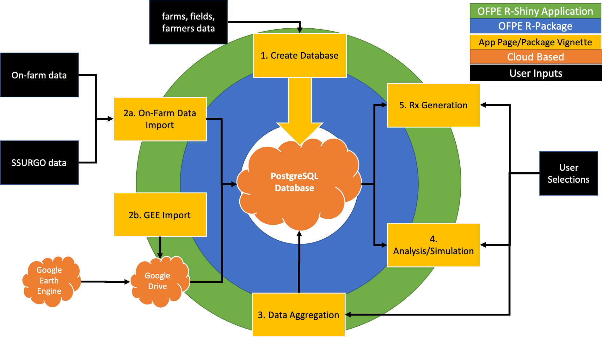

# Introduction
This tutorial covers the prescription generation step of the OFPE data cycle. This step must utilize data that has been aggregated together in the process outlined in Vignette 3, unless a random experiment is desired. This step utilizes the model fitting and simulation steps in Vignette 4, which are used to create a variable rate experimental prescription. If a random experiment is desired (i.e. for the first year), the user can pass in or access data from the database to stratify on, or to create a random experiment with no stratification. We refer to a new experiment with no stratification as random placement of experimental rates across the field, a new experiment with stratification as the placement of experimental rates across the field randomly stratified on one or more other variables, and an experimental prescription or prescription as randomly placed experimental rates, stratified on the user specified management option.

While the RxClass is flexible and may or may not depend on set up and/or executed ModClass and SimClass objects, the RxClass requires some additional user inputs beyond those from the ModClass and SimClass objects. These include the number of experimental rates and optimum rates (equipment restrictions), the proportions of each rate to be applied across the field (can decrease low rates, etc.), and the range of rates to apply. The user will also require the background rate for application between the experiments and field edge. These inputs are required for any experimental prescription or new experiment. See the 'Workflow' section below for more detail on each of the experiment and prescription generation options.

The process for creating a new experiment or generating a prescription is outlined and a more detailed description in the activity diagram on [this page](https://paulhegedus.github.io/OFPE-Website/rx_gen.html), where a component diagram can also be found. This vignette outlines step 5 of the OFPE data cycle, executed using the R package. This is represented by step 5 in the blue ring of the figure below. There is an associated page on the OFPE web application (green ring) that utilizes these R classes and functions to achieve the same effect in a user friendly environment. Note that completion of this step feeds back into step 2 in the ensuing year.

```{r, out.width='100%', fig.align='center', fig.cap='**Figure 1.** Key is found in the top right corner of the schematic. The green ring represents the R-Shiny OFPE web spplication which is driven by the OFPE R-Package (blue ring). These both require connection to a PostgreSQL spatial database with PostGIS enabled. The yellow boxes represent different pages of the OFPE web application and vignettes in the R-package. Black boxes represent user inputs and orange clouds represent cloud based tools.', echo = FALSE}

```

# Resources
The resources below are strongly recommended as supplemental information regarding the use and intent of this vignette and associated functions.

  * [OFPE Project Website](https://sites.google.com/site/ofpeframework/): Project information and products from the MSU OFPE project.
  * [OFPE Technical Website](https://paulhegedus.github.io/OFPE-Website/index.html): Website with more detailed descriptions of the OFPE data cycle and workflow, as well as tutorials for external data processes that cannot be performed in R.
  * [OFPE Overview](https://paulhegedus.github.io/OFPE-Website/ofpe_overview.html): Page of the OFPE Technical Website describing an overview of the OFPE data cycle and workflow.
  * [OFPE Rx Generation](https://paulhegedus.github.io/OFPE-Website/rx_gen.html): Detailed description of the OFPE experiment or prescription generation process.

Again, it is assumed that the user has completed Vignette 1, 2, 3, and 4 and understands the database creation, management, import, aggregation, and analysis/simulation methods described at this [site](https://paulhegedus.github.io/OFPE-Website/index.html).

# Workflow
This script requires that the user has aggregated the field yield and protein data and saved in the database. If not, this script will not run. Importing a .csv is not allowed. This script only runs with cleaned and aggregated data that is available in the '*farmername*_a' schemas of an OFPE database. 

When the user creates and experimental prescription with no stratification, the base rate surrounding experimental treatments is a farmer selected rate (common for all prescriptions). This is not the same as the farmer selected rate used in the SimClass R6 object because a farmer may want to increase or decrease the rate applied around an experiment from what they would have applied without an experiment in the field. Based on the user specified range and number of possible experimental rates, and the length and width of treatment areas, rates are randomly placed across the field. The user simply requires the specification of a field or field boundary (can be provided), and the specifications described above.

If the user selects to create a new experiment with stratification, they will be required to specify data from the database that they would like to use to stratify on (e.g. previous yield, as-applied inputs, protein), or provide shapefiles of the data they want to stratify on. Additionally, the same specifications as for a new experiment with no stratification. The experimental rates are then placed randomly, stratified on the user selected data. The user simply requires the specification of a field or field boundary (can be provided), and the specifications or data described above.

For an experimental prescription, the user specifies the economic and weather conditions they think the growing year the prescription is for will be like. All parameters specified by the user in the ModClass and SimClass R6 objects pertain to this step, so the user can initialize the RxGen R6 class with full executed ModClass and SimClass objects or simply set up objects if the user is moving directly to this step. If the latter case, the user will initialize the ModClass and SimClass R6 objects, and the methods to fit the models and simulate the specific economic and weather conditions specified by the user will be executed in the RxClass. Note that having set up ModClass and SimClass objects implies initialized and setup DatClass and EconDat objects. The RxClass can take one or multiple years for which the farmer expects the weather to be like. In the case of multiple years, all data is used and site-specific optimum rates are averaged across the years. If the user selects years to base the prescription on that have not been simulated by the SimClass, these years will be simulated and appended to the previously simulated years. This increases the efficiency of the class by not rerunning simulations. If the user selects one year and it is present in previously simulated years in the SimClass, no further simulations are needed and that specific year's output data from the SimClass is used to generate the prescription, otherwise the simulation is executed for that year.

All cases will be shown below. Prescriptions are saved to the OFPE database in the '*farmername*_a' schemas and saved to the 'Outputs' folder if desired by the user. These shapefiles should be ready for use directly in the farmer's equipment. All shapefiles are exported as longitude and latitude using the WGS84 datum.

## 1.0 Set-Up
The two sections below ('New Experiment' and 'Prescription') detail how to build an experiment, experimental prescription, or pure prescription using the RxClass. Do not run the other sections unless that is the output you intend (i.e. run the code in ONE of these sections at a time). The 'New Experiment' section simply takes a database connection object as a parameter upon initialization, and then the recommended next step is to use the interactive 'selectInputs' function rather than initialize the class with desired parameters and skipping this method. The 'Prescription' section outlines the need to provide a SimClass object upon initialization, which requires the user to initialize that class at the least. The user can choose whether to have executed simulations for given years prior to passing to the RxClass or to rely on the RxClass to run the simulations.

After the user has initialized and setup the RxClass object, the two approaches converge and run the same methods to produce the output and save it to the 'Outputs' folder and database (if desired).

It is highly recommended that the user utilizes the interactive 'selectInputs()' method to choose their experiment parameters to ensure they are in the correct format and all required parameters are supplied to the output generator.

The user must have access to an OFPE formatted database for using the vignette below. If using your own data and database, modify the pertinent information to your paths and file/folder/database names. This vignette does not use the OFPEDATA package directly, however references data from the package that was imported to the example database in Vignettes 1 and 2 and aggregated in Vignette 3. The prescription generation extends the analysis and simulations step described in Vignette 4 by generating an experimental variable rate map for the user predicted weather and economic conditions. 

```{r setup, message = FALSE, eval = FALSE}
#devtools::install_github("paulhegedus/OFPE")
library(OFPE)
```

First, a connection is formed to the database created in this [tutorial](https://paulhegedus.github.io/OFPE-Website/postgres_setup.html). This vignette, and the rest of the vignettes are working with an example database named 'OFPE' (as named in the tutorial above and exemplified in Vignettes 1, 2, and 3). This class defaults to a PostgreSQL database. The user must also provide their Google key and register it to be able to plot maps of their data. See https://github.com/dkahle/ggmap for instructions on acquiring and registering a Google API key.

```{r, eval = FALSE}
dbCon <- DBCon$new(
  user = "postgres",
  password = "<your_password>",
  dbname = "<your_db_name>", 
  host = "localhost",
  port = "5432"
)
ggmap::register_google(key = "your_google_key")
OFPE::removeTempTables(dbCon$db) # removes temporary tables. good practice
```

## 2.0 Workflow
The sections below show and describe how to use the RxClass to build a new experiment, experimental prescription, or pure prescription on a field with at least boundaries present in the OFPE database. The two sections below ('New Experiment' and 'Prescription') demonstrate and describe how to setup the RxClass to reflect the different options. The only difference is that for a prescription, a completed SimClass object needs to be passed to the RxClass object upon instantiation.

The activity workflow for creating experiments and prescriptions and a more detailed description is described on [this page](https://paulhegedus.github.io/OFPE-Website/rx_gen.html), where a component diagram can also be found.

###### Execute one of the options below within 2.1 or 2.2. Select from 2.1.1 (Randomized Experiment), 2.1.2 (Stratified Experiment), 2.2.1 (Experimental Prescription), 2.2.2 (Pure Prescription). Run your specified section then create the map for the sprayer by running section 3.0

**Important:** There are two paths for the user to take to make a prescription outlined in steps 2.1 and 2.2. The user should choose one of these options from the onset. Section 2.1 outlines making a new experiment for a field with a user specified background rate. Section 2.2 outlines how to make an experiment with a SSOPT rate created via Vignette 4 as the background rates. The user should set their experiment up in one of the two ways by initializing the RxClass with 1) only a database connection (Section 2.1) OR 2) with a database connection and fully executed SimClass object (Section 2.2). After the user sets their RxClass in either fashion, run Section 3.0. 

### 2.1 New Experiment
The two subsections below describe how to use the RxClass to build a new experiment on a field that has not had prior OFPE. This takes a field(s) boundary from the database and creates an experiment across the field with randomly placed rates (stratified or not) using the user provided rates for experimentation. To create an experiment with a prescription as a basemap or to create a pure prescription see the next section.

#### 2.1.1 New Experiment - No Stratification
This section describes the creation of a new experiment for a field without any stratification on previous data. The user simply supplies the rates and proportions of each to be applied, and an experimental rate map is generated for the user. In this section the user does require the database connection to select the field(s).

The user sets up this scenario by initializing the class with a database connection and then using the interactive method to select inputs. The arguments used in this scenario are the generator type, the treatment length and width, the orientation of the applications relative to N, the field proportion to use for experimentation, the conversion rate from lbs of the experimental input to lbs of the applied input (i.e. lbs N to gal urea), the base rate the farmer wants to apply surrounding the experiment, the year the experiment is generated for, an output path to save the experiment and figures, logical statements on whether to save to the output folder or the database, the fieldname(s) that an experiment is being generated for, the farmer name of the manager of the field, the length of experimental rates to apply (does not include the base rate), the experimental rates, and the proportion to apply each rate. 

#### 2.1.2 New Experiment - With Stratification
This section describes the creation of a new experiment for a field with stratification on previous data. The user supplies the same specifications as for the new experiment without stratification, but also specifies data in the database or a path to shapefiles that can be used to stratify rates on. The stratification data will be binned and experimental rates will be placed on unique combinations of the stratification data. 

It is recommended that the user sets up this scenario by initializing the class with a database connection and then using the interactive method to select inputs. The arguments used in this scenario are the generator type, the treatment length and width, the orientation of the applications relative to N, the field proportion to use for experimentation, the conversion rate from lbs of the experimental input to lbs of the applied input (i.e. lbs N to gal urea), the base rate the farmer wants to apply surrounding the experiment, the year the experiment is generated for, an output path to save the experiment and figures, logical statements on whether to save to the output folder or the database, the fieldname(s) that an experiment is being generated for, the farmer name of the manager of the field, the length of experimental rates to apply (does not include the base rate), the experimental rates, and the proportion to apply each rate. When stratifying on other variables, the user can pass in a list for each field with a vector of character codes for variables to stratify on. A vector of years to gather data of the specified type is also required in the same format as and corresponding to the stratification variables.

#### 2.1.3 Initialize RxClass
To initialize an RxClass for an experiment, simply pass in the database connection object. Then use the interactive 'selectInputs' method to choose your parameters. 

```{r, eval = FALSE}
rxClass <- RxClass$new(dbCon)
rxClass$selectInputs()
```

### 2.2 Prescription
The two subsections below describe how to use the RxClass to build a new prescription with or without experimental rates. These methods require the SimClass object to be provided to the RxClass. This provides the codebase and options for performing a simulation for a given year(s) to determine the net-returns of various management scenarios under user specified weather and economic conditions. While the user has the option of simulating more years upon initialization of the RxClass, it is assumed that the user performed their simulations in the SimClass with the economic data they want to use to generate the prescription.

To initialize an RxClass for an experiment, a set up and executed SimClass object must be passed in with a database connection. Once the SimClass object has been instantiated and executed, it can be passed into the RxClass upon initialization. The code below repeats the code found in Vignette 4. 
```{r, eval = FALSE}
datClass <- DatClass$new(dbCon)
datClass$selectInputs()
modClass <- ModClass$new()
modClass$selectInputs(datClass$respvar)
econDat <- EconDat$new()
econDat$selectInputs()
simClass <- SimClass$new(dbCon)
simClass$selectInputs(datClass$farmername, datClass$fieldname)
invisible(datClass$setupDat())
invisible(modClass$setupOP())
invisible(modClass$setupMod(datClass))
invisible(modClass$fitModels())
invisible(modClass$savePlots())
invisible(simClass$setupSim(datClass, modClass, econDat))
simClass$executeSim()
simOP <- SimOP$new(simClass, create = TRUE)
invisible(simOP$savePlots())
```

After a SimClass object has been fully executed and specified, this can be passed into a RxClass upon initialization to take advantage of the SSOPT rates created as a result of the Monte Carlo analysis (see Vignette 4). See Section 2.2.1 and 2.2.2 below for choosing between one of two methods for creating an experimental prescription utilizing data from your SimClass. After choosing either method 2.2.1/2.2.2, execute Section 2.2.3 in the appropriate fashion. 

#### 2.2.1 Experimental Prescription
This section describes the creation of an experimental prescription. This process extends from the analysis and simulation step that identifies the optimum as-applied rates for each of the management scenarios. The user will select their preferred management scenario and then experimental rates are randomly placed, stratified on the optimized rate map. This creates a map with the optimum rates as the "background" to experimental rates. This allows the generation of more data to use for fitting the crop response models that are used for generating the optimized maps. However, the option is available for the user to decide to stop experimentation and create prescriptions (see section below). The user can provide experimental rates or can elect to auto select experimental rates between gaps in the optimum rates. This is provided by the 'exp_rate_gen' argument, with TRUE indicating auto selection. The two headings below portray the two setup options.

#### 2.2.2 Pure Prescription
This section describes the creation of a "pure" prescription without experimental rates based on a user specified management scenario. This process also extends from the analysis and simulation step and requires user to specify the management scenario on which to create the prescription. Based on the user selections, the optimized rates from the outcome of the simulation for the user specified economic and weather conditions is used to generate the map for the user. Before export, treatment blocks of a farmer selected rate indicating what their "business as usual" rate would have been, are randomly placed in each of the experimental rates. This provides a check for the optimized rates against what the farmer would have applied, to evaluate the efficacy of the optimized rates. If not outperforming the farmer selected rates, resuming experimentation is recommended to further tune the crop responses models and provide stronger predictions for generating optimized rates.

### 2.2.3 
When the user has a completed SimClass object, initialize the RxClass with your database connection object and the simulation class and select your inputs for creating an experimental prescription or pure prescription.
```{r, eval = FALSE}
rxClass <- RxClass$new(dbCon, simClass)
rxClass$selectInputs()
```

## 3.0 Execute
Now that the RxClass has been initialized (in any of the ways above) and setup according to user specifications, the RxClass methods can be used to generate the user specified output and save to the 'Outputs' folder and to the database.

```{r, eval = FALSE}
rxClass$setupOP()
rxClass$setupGen()
rxClass$executeOutGen()
invisible(rxClass$saveOutputs())
```

# Conclusion
At this point, the user will have have generated a prescription or experiment for their specified field. If the user allowed, this will have been exported to the 'Outputs' folder along with some complementary figures, and/or will be saved in the database in the '*farmername*_a' schemas in a table called 'rx'. 

A diagram demonstrating the implementation and existence of modules related to the experiment or prescription generation step can be seen [here](https://paulhegedus.github.io/OFPE-Website/rx_gen.html), diagramming the relationship of the classes used in this step. 

Whenever a database connection is open it needs to be closed.
```{r, eval = FALSE}
dbCon$disconnect()
```


